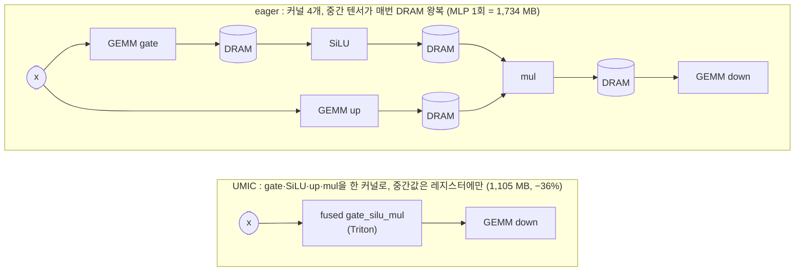
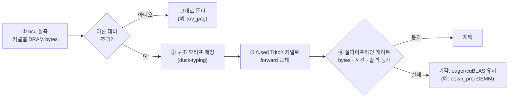

# umic-alpamayo

**UMIC (Unified-Memory Inference Compiler): 커널 fusion과 실행 스케줄 교체만으로 Jetson AGX Thor에서 NVIDIA Alpamayo 1.5 추론을 30% 가속하는 런타임.**

-76b900)


체크포인트 수정 없음, 양자화 없음, 근사 없음. 같은 수학을 **더 적은 커널, 더 적은 DRAM 왕복**으로 실행한다. 출력은 eager와 등가임이 검증되어 있다 (3,106 토큰 전부 일치, 궤적 ADE 3.8 mm).

이 repo는 **UMIC 확정분을 Thor에서 바로 실행하고 구조를 이해하기 위한 최소 runtime repo**다. Alpamayo weight와 dataset은 포함하지 않으며, speculative decoding은 아직 실험 중이라 범위에서 제외한다. 포함/제외 범위는 [docs/current_scope.md](docs/current_scope.md), 처음 실행하는 연구생용 체크리스트는 [docs/onboarding.md](docs/onboarding.md)를 참고한다.

| 단계 | eager | UMIC | 개선 |
|------|-------|------|------|
| Vision Encoder | 484 ms | **194 ms** | **−59.9%** |
| LM Prefill | 842 ms | **587 ms** | −30.3% |
| LM Decode | 74.3 ms/step | **71.8 ms/step** | −3.4% |
| Flow (Action Expert) | 671 ms | **417 ms** | −37.9% |
| **전체 (16-step 정규화 wall)** | **3,185 ms** | **2,347 ms** | **−26.3%** |

<sub>가장 최근 검증 2026-07-06, 클럭 고정 상태에서 `run_pipeline.py --mode both`로 eager·UMIC을 같은 세션에 연속 측정한 수치다. 재현: `bash scripts/run_all.sh`(§7 측정 규칙 참고). 이전 측정값과 각 변경의 배경은 [CHANGELOG.md](CHANGELOG.md)에 날짜별로 남아있다.</sub>

```bash
git clone https://github.com/soonhong99/umic-alpamayo.git && cd umic-alpamayo
bash scripts/run_all.sh        # 클럭 고정 → 환경 점검 → eager vs UMIC 벤치마크까지 한 번에
```

---

## 1. 왜 빨라지는가: 문제는 연산이 아니라 DRAM 왕복

Thor 같은 unified-memory iGPU에서 Alpamayo 추론의 병목은 연산량(FLOPs)이 아니라 **DRAM 트래픽**이다 (decode는 대역폭 89% 포화). 그런데 PyTorch eager는 커널 경계마다 중간 결과(activation)를 DRAM에 쓰고 다시 읽는다. ncu 하드웨어 카운터로 실측하면 모델 가중치의 수십 배에 달하는 bytes가 버스를 오간다. 심지어 cuBLAS GEMM조차 Thor SM 11.0에서 특정 shape은 이론값의 **6.6×** bytes를 움직인다.

UMIC은 이렇게 낭비되는 왕복을 커널 fusion으로 제거한다. 예를 들어 LM의 MLP (P5 패턴):



가중치는 그대로 공유하고(복사·변환 없음), 해당 모듈의 `forward`만 런타임에 교체한다. 그래서 체크포인트도 모델 소스도 건드리지 않는다.

## 2. 어떻게 결정하는가: measurement-guided compilation

무엇을 fusion할지는 사람이 감으로 고르지 않고, **정해진 규칙**으로 결정한다:



1. **목적함수는 DRAM bytes.** ncu 카운터로 커널별 실측 트래픽을 이론값(입출력+가중치 크기)과 비교해, 초과하는 지점만 후보로 삼는다. 이미 이론값에 도달한 커널(k/v projection 등)은 건드리지 않는다.
2. **매칭은 클래스가 아니라 구조.** "gate/up/down Linear + SiLU를 가진 모듈"처럼 모티프로 찾기 때문에(duck-typing) 모델 버전이 바뀌어도 모티프가 남아 있으면 그대로 동작한다. 매칭 실패는 에러가 아니라 no-op이고, 모든 커널에 eager 폴백이 내장되어 정확도는 절대 깨지지 않는다.
3. **채택은 마이크로벤치가 아니라 실파이프라인 실측으로만.** 단독 벤치에서 이겨도 실제 모델 안에서 지면 기각한다 (커널 성능은 L2 경합 등 문맥 의존적임을 반복 실측으로 확인).
4. **regime-aware dispatch.** 같은 모듈이라도 prefill(수천 row GEMM)에는 fused 커널, decode(1 row GEMV)에는 cuBLAS가 최적이라 row 수로 분기한다 (`FUSE_MIN_ROWS=64`).

이 규칙이 실제로 작동한다는 증거가 **기각 목록**이다:

| 후보 | 단독 벤치 | 실파이프라인 | 판정 |
|------|-----------|--------------|------|
| down_proj GEMM → Triton | 승리 (4.94 vs 5.45 ms) | e2e에서 +30 ms | **기각**, cuBLAS 유지 |
| ViT fc1+GELU fusion | K=1280에서 cuBLAS 승리 | - | **기각** |
| cross-stage prefetch | - | stage 전환 bubble 실측 0.6%뿐 | **폐기** (unified memory엔 숨길 전송이 없음) |

## 3. 무엇이 바뀌는가: 채택된 최적화 11종

| # | 패턴 | eager의 낭비 | UMIC | 대표 실측 |
|---|------|--------------|------|-----------|
| 1 | MLP gate·SiLU·up (P5) | 커널 4개, DRAM 왕복 3회 | 1 커널 | Prefill DRAM 232→148 GB |
| 2 | q/o projection | cuBLAS가 이론의 6.6× bytes | Triton GEMM (1.14×, L2 hit 94%) | → 134 GB |
| 3 | RMSNorm | fp32 pow/mean/mul/cast 체인 5+ 커널 | 1 커널 (이론 1.00×) | → 86 GB, 커널 수 2,070→947 |
| 4 | residual add + norm (LM) | 독립 elementwise 왕복 | post-norm에 흡수 | flow −7 ms |
| 5 | RoPE (vision/text) | fp32 cast+cat 8 커널, 8.9 ms/block | 1 커널 0.63 ms (14.2×) | VE 728→454 ms |
| 6 | LayerNorm (ViT) | RMSNorm과 동일 병리 | 1 커널 | VE DRAM −12.6% |
| 7 | KV cat-copy | DynamicCache가 매 step 3,100토큰 prefix 재복사 | InplaceKVCache: in-place 쓰기, crop은 포인터 이동 O(1) | Flow DRAM 122→84 GB |
| 8 | decode dispatch bubble | CPU 커널 launch 대기로 GPU idle ~10.6% | KV 길이별 CUDA Graph, 추론 간 재사용 (10 Hz 운영 시 캡처 1회 후 replay만) | decode −13% |
| 9 | ViT 패치 임베딩 (Conv3d) | stride=kernel(비중첩)인데 conv 경로로 처리, cuDNN이 이론보다 53× 느린 implicit-GEMM 사용 | 동일 연산인 Linear로 교체(fp64로 등가성 확인) | 18.97→0.36 ms |
| 10 | ViT attention split+concat | 이미지 16개를 따로 attn 계산 후 concat, 커널 호출 432회 | 1회의 packed varlen attention(`_flash_attention_forward`), 커널 호출 27회 | −7.33%, bit-exact |
| 11 | ViT residual add + LayerNorm | 블록 내부·블록 간 잔차 덧셈이 별도 커널로 유휴 | 24/27 지점에서 add+LN 융합(내부 1곳 + 블록 간 다음 norm까지) | −4.16% (내부+교차) |

1~7·9·11은 커널 fusion, 7은 복사 제거이기도 하고, 8은 스케줄링(유휴시간 제거), 10은 배칭(커널 호출 수 축소)이다. 전부 "같은 수학, 다른 실행"이라는 원칙 안에 있다(9~11은 fp64/bit-exact로 등가성 확인, 상세: [docs/260706_ve_production_integration.md](docs/260706_ve_production_integration.md)). 유일한 예외로 근사 옵션 `adaptive_flow`(중간 ODE step 생략, flow −40%, 궤적 ~4 cm 편차)가 있으며 **기본 off**다.

---

## 4. 빠른 시작 (Thor 보드에서)

```bash
git clone https://github.com/soonhong99/umic-alpamayo.git
cd umic-alpamayo
bash scripts/run_all.sh             # 초기 세팅부터 벤치마크까지 전부 한 번에
```

`run_all.sh` 하나가 실험 초기 세팅 전체를 순서대로 수행한다:
① `sudo jetson_clocks` 클럭 고정 (비밀번호 1회 입력, §7 규칙 1) → ② `~/alpamayo1.5/a1_5_venv` 활성화 → ③ 환경+커널 점검 (실패 시 벤치마크 진입 전에 중단) → ④ eager vs UMIC 벤치마크 (**warmup 5회** + 측정 3회, §7 규칙 2 기본 내장).

추가 인자는 그대로 벤치마크에 전달된다:

```bash
bash scripts/run_all.sh --mode umic            # UMIC만 측정
bash scripts/run_all.sh --runs 6 --warmup 8    # 더 긴 측정
```

단계를 나눠 실행하려면: `bash scripts/setup_thor.sh` (세팅+점검만) 후 `python scripts/run_pipeline.py --mode both`. `run_pipeline.py`를 단독 실행해도 클럭 미고정을 감지하면 스스로 `sudo -n jetson_clocks`로 고정을 시도하고, 실패하면 경고를 출력한다.

<details>
<summary><b>요구 환경</b> (Thor의 기존 alpamayo venv면 전부 충족)</summary>

| 항목 | 값 |
|------|-----|
| 보드 | Jetson AGX Thor (SM 11.0, JetPack 7, CUDA 13.0) |
| Python | 3.10+ (Thor 표준: 3.12) |
| PyTorch | 2.8.0 (Thor는 소스 빌드 필수: 공식 aarch64+CUDA13 wheel 없음) |
| Triton | 3.7.0 (직접 `@triton.jit`은 SM 11.0에서 정상 동작; 없으면 전부 eager로 폴백) |
| transformers | ≥ 4.56 (`Cache.layers` API 기준) |
| Alpamayo | `nvidia/Alpamayo-1.5-10B` HF 캐시 (선택: 없어도 커널 검증까지는 가능, §6) |

</details>

## 5. 실행하면 무엇이 나오는가

run마다 단계별 ms가 이 보드의 기대 범위([configs/expected_thor.yaml](configs/expected_thor.yaml))와 함께 출력되고, 범위 안이면 `[OK]`, 벗어나면 `[SLOW]`/`[FAST]`로 판정된다.

아래는 2026-07-06 이 repo 검증 실행의 실제 출력이다(VE 3종 융합 추가 반영):

```
=== umic run 3/3 (19 decode steps) ===
stage                measured      expected     verdict
-------------------------------------------------------
VE                    194.3 ms       170-230    [OK]
LM Prefill            587.7 ms       520-660    [OK]
Decode/step (SS)       71.8 ms         64-78    [OK]
Flow                  416.9 ms       370-500    [OK]
Wall total           2590.6 ms     2250-2950    [OK]

 eager median: VE 484 | Prefill 842 | Decode 74.3/step | Flow 671 | wall 3211 ms
  umic median: VE 194 | Prefill 587 | Decode 71.8/step | Flow 417 | wall 2591 ms
UMIC vs eager wall (16-step normalized): -26.3%  (3185 -> 2347 ms; official reference: -29.8%)
```

판정 해석:
- `[SLOW]`: 거의 항상 클럭 미고정(`sudo jetson_clocks` 후 재실행) 또는 웜업 부족(steady state는 warmup 포함 5+ run 뒤, 기본값이 warmup 5).
- `[FAST]`: 다른 clip이거나 decode step 수가 짧은 경우(wall은 step 수에 비례).
- decode step 수는 샘플링에 따라 run마다 13~20으로 달라지므로, eager vs UMIC 최종 비교는 **16-step 정규화 wall** 기준으로 출력된다.
- 전체 개선율은 그날의 eager 기준선에 따라 −18 ~ −30% 범위로 움직인다 (UMIC 절대치는 안정적, eager가 보드 상태에 더 민감).

결과 JSON은 `results/run_<timestamp>.json`에 저장된다 (run별 전체 수치 + median 요약).

## 6. 코드에서 직접 쓰기 (API)

벤치마크 없이 기존 추론 코드에 UMIC만 얹으려면 editable install 후 한 줄이면 된다. `run_all.sh`와 `run_pipeline.py`는 `PYTHONPATH=src`로 실행되지만, 별도 Python 코드에서 `import umic`을 쓰려면 설치가 필요하다.

```bash
python -m pip install -e .
```

```python
from alpamayo1_5.models.alpamayo1_5 import Alpamayo1_5
import torch, umic

model = Alpamayo1_5.from_pretrained(
    "nvidia/Alpamayo-1.5-10B", dtype=torch.bfloat16, local_files_only=True,
).cuda().eval()

report = umic.apply(model)      # §3의 8종 전부 적용, 패치 카운트 리포트 반환
```

- 선택 적용: `umic.apply(model, umic.UmicConfig(decode_graph=False))` 처럼 항목별 on/off. 항목 정의는 [src/umic/optimize.py](src/umic/optimize.py)의 `UmicConfig` docstring 참고.
- Alpamayo가 아직 없는 보드라도 CUDA/Triton이 준비되어 있으면 `python scripts/check_env.py`로 환경과 커널 5종(랜덤 텐서, 실제 파이프라인 shape)까지 먼저 검증할 수 있다. 전부 `[OK]`면 UMIC 커널 경로는 준비된 것.
- Alpamayo 로딩 주의: `Alpamayo1_5.from_pretrained`는 로컬 절대경로를 받지 못한다. 반드시 HF repo id + `local_files_only=True`.

## 7. 측정 규칙 (지키지 않으면 수치가 어긋난다)

1. **측정 전 `sudo jetson_clocks` 필수.** decode처럼 memory-bound인 단계는 SM 사용률이 낮아 DVFS 거버너가 클럭을 올리지 않는다. 같은 코드가 거버너 상태에서 ~107 ms/step, 고정 상태에서 70 ms/step. `run_all.sh`가 첫 단계로 수행한다.
2. **steady state는 warmup 포함 5+ run 후 판정.** 클럭 고정 상태에서도 allocator/페이지 워밍으로 모든 단계가 run 0→4에 걸쳐 계단식으로 내려온다 (실측: VE 427→305 ms, decode 102→70 ms/step). 기본값이 **warmup 5 + 측정 3**이라 측정 run은 전부 steady state에서 시작하고, CUDA Graph 캡처 비용(~19개)도 warmup에서 소화된다.

## 8. 프로젝트 구조와 배경 문서

```
src/umic/
  optimize.py     umic.apply() 원콜 API + UmicConfig
  integrate.py    구조 매칭 융합 주입 (fuse_mlps / fuse_rmsnorms / ...)
  kernels/        Triton 커널 5종 (fused_ffn, linear, rmsnorm, layernorm, rope)
  cache.py        InplaceKVCache
  graph.py        per-KV-length decode CUDA Graph
  diffusion.py    adaptive flow (opt-in 근사)
  bench.py        단계별 CUDA-event 타이밍 하네스 + 기대범위 판정
scripts/
  run_all.sh      초기 세팅 + 벤치마크 원커맨드
  run_pipeline.py 메인 실행 (--mode umic|eager|both)
  check_env.py    환경 점검 + 커널 스모크 (Alpamayo 불필요)
  setup_thor.sh   클럭 고정 + venv + 점검만
configs/
  expected_thor.yaml  이 보드의 단계별 기대 ms 범위 (판정 기준)
```

- [CHANGELOG.md](CHANGELOG.md): 날짜별 변경 이력과 그 시점의 측정값(README는 항상 최신 수치만 유지)
- [docs/REPORT_TEMPLATE.md](docs/REPORT_TEMPLATE.md): 이 repo의 조사/변경 보고서 작성 표준(개조식, 개정이력 표 포함)
- [docs/260706_ve_production_integration.md](docs/260706_ve_production_integration.md): VE 3종 융합(패치 임베딩·varlen attention·residual+LN 파이프라인) 발견 과정과 production 통합 전 과정
- [docs/260611_official_benchmark.md](docs/260611_official_benchmark.md): 공식 수치의 측정 조건과 구 수치 정정 이력
- [docs/260611_output_equivalence.md](docs/260611_output_equivalence.md): 출력 등가성 게이트 (토큰 일치 + ADE 3.8 mm)
- [docs/current_scope.md](docs/current_scope.md): 이 repo에 포함된 확정 범위와 제외 범위
- [docs/onboarding.md](docs/onboarding.md): 새 연구생용 첫 실행 체크리스트
- [docs/260610_01_umic_design_ko.md](docs/260610_01_umic_design_ko.md): 초기 UMIC 설계서와 연구 로그 (일부 private repo 경로 포함)
- 실험 전 과정(ncu 측정, 기각된 시도 포함)은 연구 repo `soonhong99/umic` (private)

## 9. 기여

새 최적화를 추가하거나 버그를 보고하려면 [CONTRIBUTING.md](.github/CONTRIBUTING.md)를 먼저 읽는다. 이슈/PR 템플릿이 자동으로 뜬다.

License: research use only. Alpamayo 1.5는 NVIDIA non-commercial research license를 따른다.
